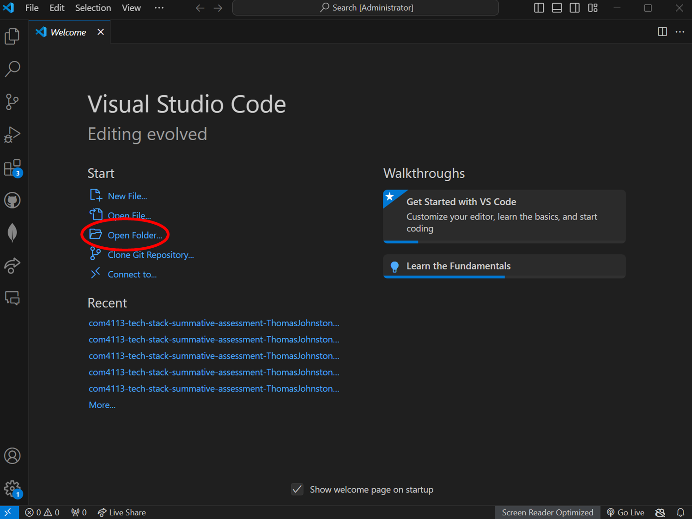
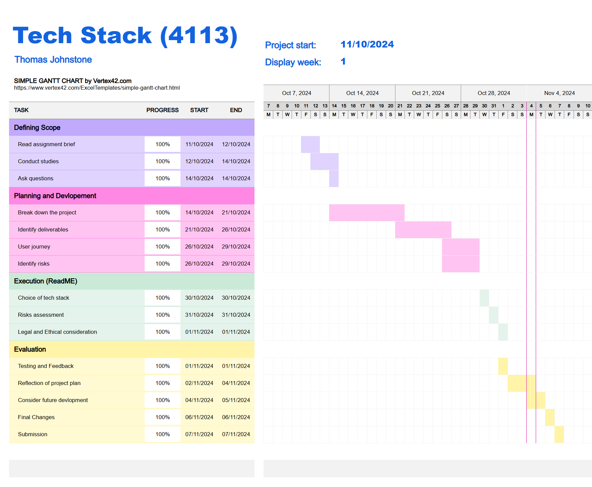
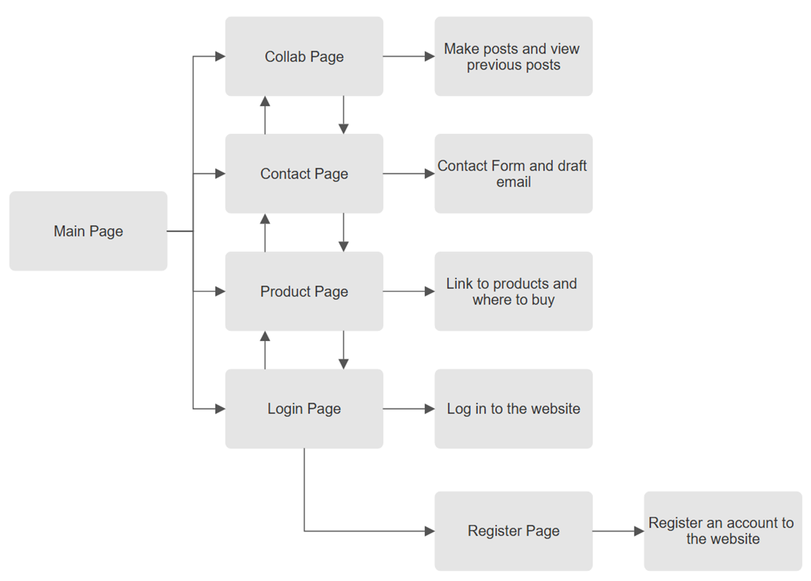

# Choice of tech stack

In this project I have decided to use various programming tools to reach the desired goal of the assingment brief. To achieve this, i have used HTML, CSS and JavaScript. Firstly, HTML is used as the front end of the website and controls how to website is structured. Next, CSS applys the styling and presentation, this help with the design and overall look of the website. Lastly JavaScript adds interactivity to the website, allowing moving images, sticky headers, functional searching and much more. Together these are the powerhouse of Web Development and are core technologies used in most real life scenarios. With this, it makes learning HTML CSS and JavaScript practical seen as its used a lot in the web. Furthermore, with it being quite a well known profession there are many libraries and frameworks that can assist you when making website, these examples include Bootstrap for CSS and React for JavaScript.

There are various other tech stack I could use

compare

# Version Control

Hello, Welcome to my repsoitorty for Tech Stack Assessment 1.

Here is the link to my repsoitorty:
https://github.com/CS-LTU/com4113-tech-stack-summative-assessment-ThomasJohnstone8.git

# Project Overview

project goals and objectives and the scope of the project

In this project I aim to create a fully functioning website using HTML, CSS and JavaScript. In this website I will include user registration and authentication, the user will be able to sign up, login and manage the account. Another feature I will add is the ability to upload a profile picture, update it and list their intrests in the profile. I will add more, smaller features such as a drop down menu to help navigate the website, an About Us page which gives the user insight to the website and its uses, a Contact Us page which gives to user options to contact us, user reviews so the user can leave reviews of the place, a simple Homepage that directs the user in different directions and lastly a search for AI tools section (product page).

(add any changes to the project plan as it progresses)

# Installation Instuctions

Step 1: unzip the file from moodle

Step 2: add the unzipped file to VS code

Step 3:

step by step guide that explains the set up of developer enviroment, how to install dependencies and how to get the application running on a local machine

# Project Plan

Below is my Gantt Chart that I used to help track and manage my time throughout the project. the gantt chart has been updated to reflect the change to the deadline as well. The gantt chart includes all the correct fields such as choice of tech stack, legal and ethical consideration. A few changes were made to the gantt chart to adapt to the change in submission and it allowed me to spend more time fleshing out the wesbite and improving the overall look of it using HTML and CSS features. As well as this, it allowed me to manage my time better and space out spending a day on each of the documentation.

# User Guide

Below are instructions of how to navigate the website through a flowchart, this dictates the flow of the website and how the user can navigate it

# Legal and ethical consideration

When it comes to website many legal and ethical considerations must be identified, one of which being privacy and data protection. The website must follow the rules and regulations of the current GDPR data collection schemes and data privacy laws that take place. All practices of this must be written and had the user knowledge of it, this could be done through a consent form which they read and accept the terms and conditions of how the website handles data privacy. Another legal practice to consider is copyright and ensuring all content (text, video, image, templates) are used legally and license and either paid and acknowleged or references have been made to the original author or owner. This is to avoid copyright infringnment and ensure proper credit is given to those whose made it. There are laws that force the website to align with disabilties and ensure it is accessible to all users including disabled ones. This is used to create a safe and collabrative enviroment that allows for all individuals to use the website. Another legal practice to ensure is avioding harm. The liability of the services I provide are on my shoulder and I should consider what product the website sells and ensure they display no harm be that physical or emotional as this can impact the website neagtively. Lastly the website needs to be transparent with the terms and conditions, this will lead to a better relationship with the users and thus a better website.

# Risk assessment

add evidence 

fake account be careful

ask AI 

# Future considerations

My future considerations for this project would be to include a scalable host and a backend to the server. This backen database will allow the user to login and register an account, this interactivity will allow the user to interact with the website more by locking the features behind a login. Another imrpovement i will make is adding a cart and better product system, this will allow the user to navigate the product page better aswell as adding and removing products in a cart would help the user when purchasing multiple items. A scalable host would allow the wesbite to expand in the future and allows for more features and expansions. Returning to the product page, at the moment of the website being made the likes and dislikes are native to your personal computer. In the future I would like to expand this and allow the likes and dislikes to be stored in a database and the product to be ranked from top to bottom based of the likes and dislikes. This would be a complicated expansion however, in the future it is a doable task. To conclude my future improvements I will develop the template more and change it. In the assignment I used a template and in the future I will consider changing this and starting from scratch, this can be achieved with a better understanding of HTML, CSS and JavaScript. 

# In Code documentation

I have added comments throughout my code to help the uesr navigate the code and understand it.

